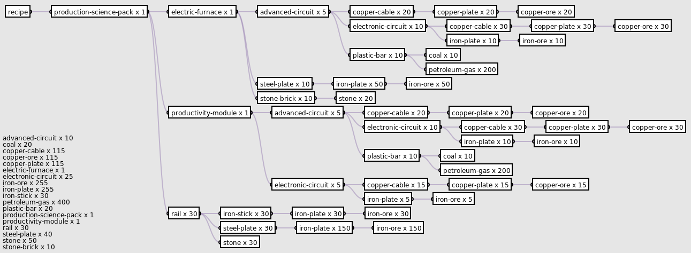

## Overview

<p align="center">
  
</p>

The tree is a remarkably useful data structure. There are many things in the
real world that can be modelled as trees, such as org charts, class diagrams,
DOMs, and decision trees.

I am used to representing trees using YAML-like syntax. E.g.:

```YAML
production-science-pack x 1
  electric-furnace x 1
    advanced-circuit x 5
      copper-cable x 20
        copper-plate x 20
          copper-ore x 20
      electronic-circuit x 10
        copper-cable x 30
          copper-plate x 30
            copper-ore x 30
        iron-plate x 10
          iron-ore x 10
      plastic-bar x 10
        coal x 10
        petroleum-gas x 200
    steel-plate x 10
      iron-plate x 50
        iron-ore x 50
    stone-brick x 10
      stone x 20
  productivity-module x 1
    advanced-circuit x 5
      copper-cable x 20
        copper-plate x 20
          copper-ore x 20
      electronic-circuit x 10
        copper-cable x 30
          copper-plate x 30
            copper-ore x 30
        iron-plate x 10
          iron-ore x 10
      plastic-bar x 10
        coal x 10
        petroleum-gas x 200
    electronic-circuit x 5
      copper-cable x 15
        copper-plate x 15
          copper-ore x 15
      iron-plate x 5
        iron-ore x 5
  rail x 30
    iron-stick x 30
      iron-plate x 30
        iron-ore x 30
    steel-plate x 30
      iron-plate x 150
        iron-ore x 150
    stone x 30
```

The problem with this representation is that it is not as economical in the
x-dimension as it could be, and because we are relying on indentation instead of
explicit lines to determine parentage, it can be hard to determine how many
children a given node has. This problem only multiplies as the size of the tree
increases. Using a tree representation also allows us to perform transformations
like sorting and pruning.

## Features

## Setup

## Usage

## Examples

## Dependencies

## Implementation Details

## Limitations

## License

This work is licensed under the GNU General Public License version 3 (GPLv3).

[](https://www.gnu.org/licenses/gpl-3.0.en.html)
